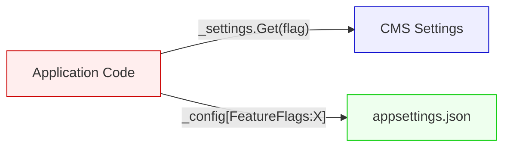
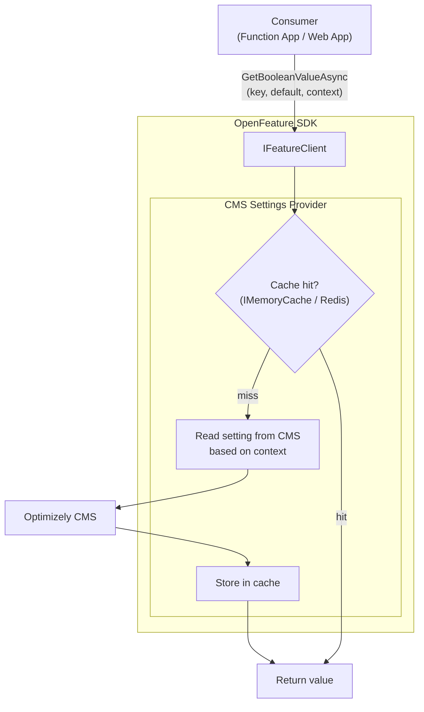
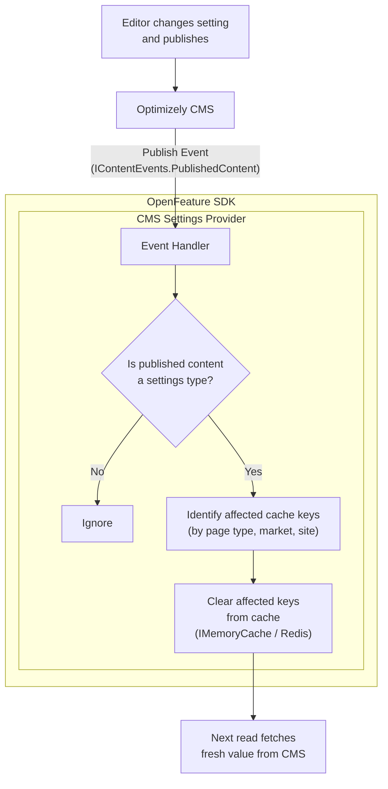
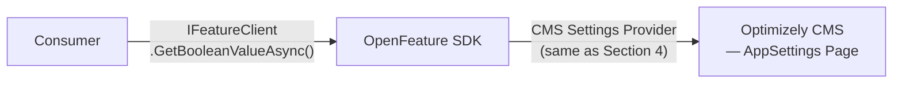
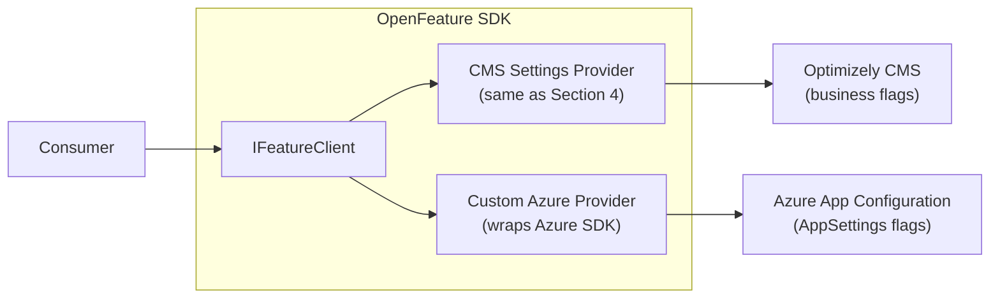
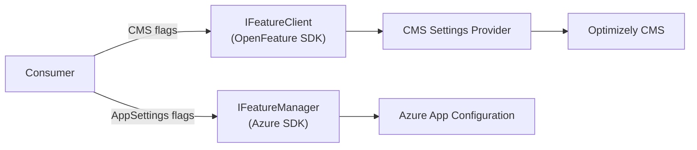
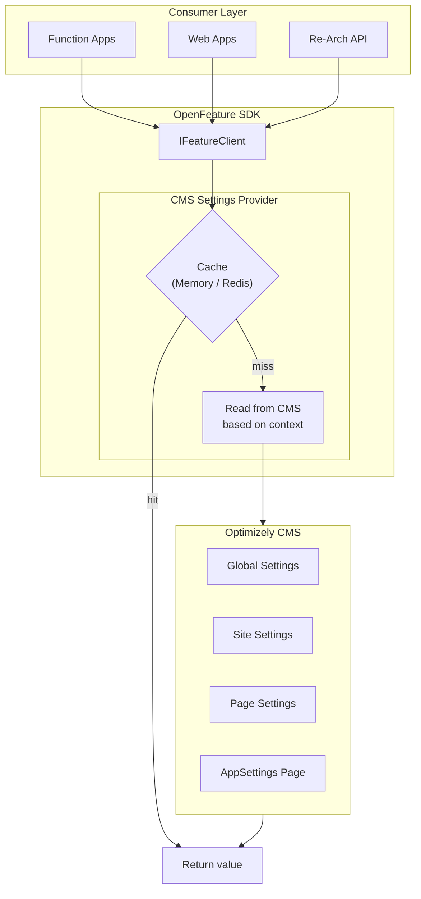
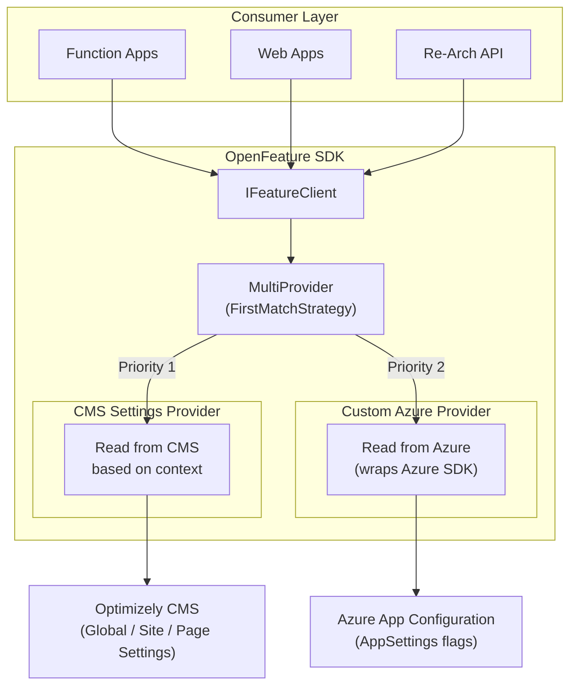
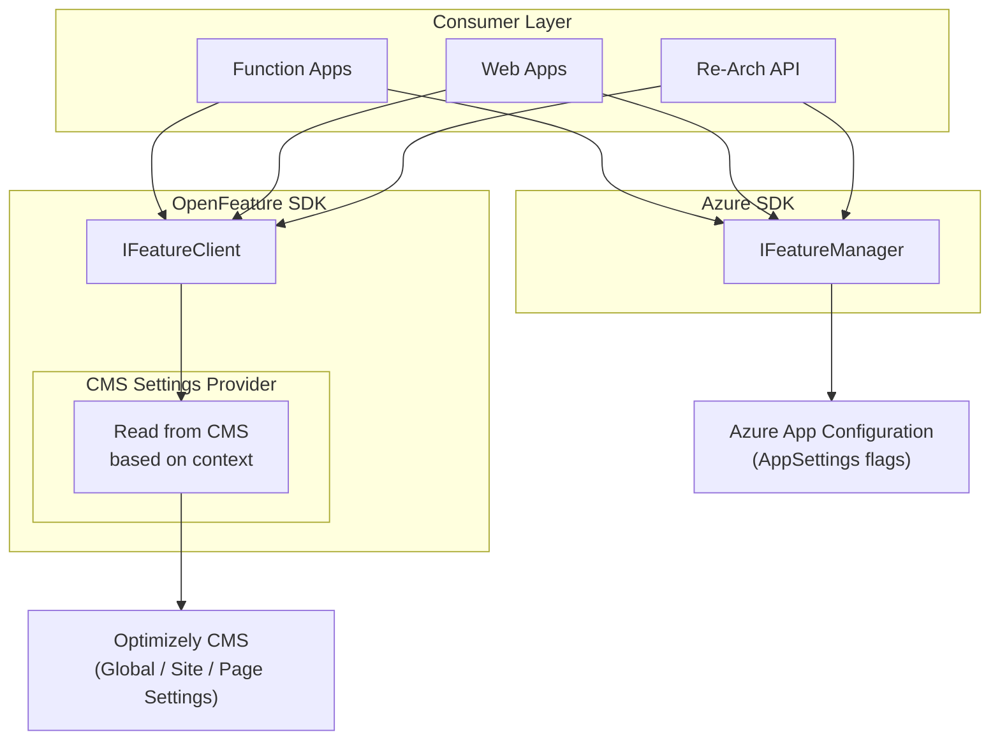
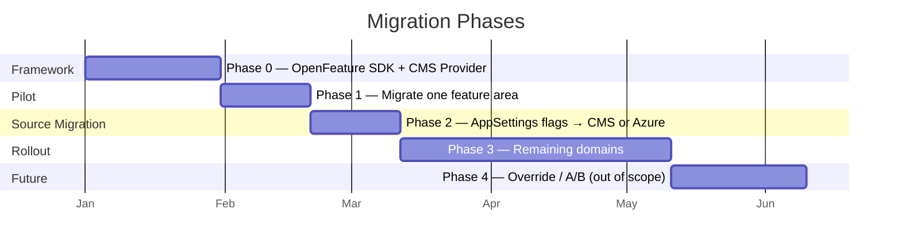

# Feature Toggle Framework — Architecture Spike

**Version:** 3.1
**Status:** Draft
**Last Updated:** 2026-03-29

---

## 1. Problem Statement

Feature toggles are currently consumed across multiple layers of the solution. Application code reads toggle values directly from different sources — CMS settings, configuration files, and Akamai CDN settings — with no abstraction in between.

This causes:

- **Tight coupling** — business logic knows which source a flag lives in
- **Inconsistent resolution** — each developer reads from sources differently, no standard precedence
- **No override capability** — cannot override toggle values for A/B test scenarios without touching the original source
- **Poor transparency** — no single place to see which flags are active and where they come from

---

## 2. Current State — Two Toggle Sources



> No abstraction layer. Each call knows its source.

| # | Source | Managed By | Runtime Changeable? |
|---|---|---|---|
| 1 | **CMS Settings** (Optimizely) — Global, Site, and Page settings | Editors via CMS UI | Yes (on publish) |
| 2 | **AppSettings** (`appsettings.json` / env vars) | Developers / DevOps | No (requires redeploy) |

Each source is addressed separately in the sections below.

---

## 3. Proposed Abstraction — OpenFeature SDK

We propose using **OpenFeature SDK** (CNCF open standard) as the unified abstraction layer for all feature flag consumption, regardless of source.

Reference: https://openfeature.dev/docs/reference/sdks/server/dotnet/

| Concept | Role |
|---|---|
| `IFeatureClient` | Single interface all consumers use to read flags |
| `FeatureProvider` | Adapter that reads from a specific source (we implement custom providers) |
| `MultiProvider` | Chains multiple providers with priority order |
| `EvaluationContext` | Carries runtime context (market, brand, userId, pageReference, etc.) |
| `InMemoryProvider` | Built-in provider for unit tests |

**Consumer code — same pattern regardless of which source the flag comes from:**

```csharp
var ctx = EvaluationContext.Builder()
    .Set("market", market)
    .Set("brand", brand)
    .Build();

var flag = await _featureClient.GetBooleanValueAsync("EnableFreeShipping", false, ctx);
```

---

## 4. Source 1 — CMS Settings (Optimizely)

This is the **primary source** for feature toggles. CMS Settings exist at three levels:

| Level | Scope | Example |
|---|---|---|
| **Global Settings** | Entire system | `EnableLegacyMode` |
| **Site Settings** | Per site / market | `EnableFreeShipping` for market VN |
| **Page Settings** | Per specific page | Settings section within a page |

### 4.1 Solution — CMS Settings Provider

A single custom OpenFeature provider that reads all three levels from Optimizely CMS.

**Read Path:**



**Write Path (Cache Invalidation):**



> **Note:** The event handler must filter by content type to avoid clearing cache on every publish. Only publishes of settings-related content types should trigger cache invalidation.

### 4.2 Caching Strategy

| Layer | Mechanism | Invalidation |
|---|---|---|
| L1 — In-process | `IMemoryCache` | CMS publish event clears keys |
| L2 — Distributed (optional) | Redis | CMS publish event clears keys |

---

## 5. Source 2 — AppSettings (`appsettings.json`)

### What is in scope

Only the **feature flags** in `appsettings.json` are in scope. Infrastructure config stays in `appsettings.json`.

```
appsettings.json
├── ConnectionStrings.*     ← OUT OF SCOPE — stays here
├── Logging.*               ← OUT OF SCOPE — stays here
├── ServiceEndpoints.*      ← OUT OF SCOPE — stays here
└── FeatureFlags.*          ← IN SCOPE — needs a new home
    ├── EnableLegacyMode
    └── MaxRetryCount
```

### Two Options

---

#### Option A: Migrate to a CMS Settings Page

Create a dedicated settings page in CMS (e.g., "Technical Feature Flags") for flags currently in `appsettings.json`. Read them via the existing CMS Settings Provider.

Same Read/Write path as **Source 1 — CMS Settings** (see Section 4.1). The only difference is the flag is stored on a dedicated **AppSettings Page** in CMS instead of Global/Site/Page Settings.



| Pros | Cons |
|---|---|
| Single provider — simplest architecture | Technical flags in CMS UI — risk of unintended changes |
| All flags runtime-changeable without redeploy | Full dependency on CMS availability |
| No additional infrastructure cost | |

**Mitigation:** Restrict the technical settings page via CMS access control — only developers/admins can edit.

---

#### Option B: Use Azure App Configuration

Move feature flags from `appsettings.json` to **Azure App Configuration** — a managed Azure service built for feature flag management.

Reference: https://learn.microsoft.com/en-us/azure/azure-app-configuration/manage-feature-flags

CMS business flags still use the same Read/Write path as **Source 1 — CMS Settings** (see Section 4.1). For AppSettings flags in Azure App Configuration, there are **two integration approaches**:

**Approach B1 — Custom OpenFeature Provider**

Implement a custom OpenFeature provider that wraps Azure App Configuration. All consumers still use `IFeatureClient` — consistent with CMS flags.



**Naming convention:** Use a prefix to identify the source of each flag. For example:
- CMS flags: `cms.EnableFreeShipping`, `cms.CheckoutFlow`
- AppSettings flags: `app.EnableLegacyMode`, `app.MaxRetryCount`

The MultiProvider uses this prefix to route the request to the correct provider.

| Pros | Cons |
|---|---|
| Unified interface — all flags via `IFeatureClient` | Need to build and maintain a custom provider |
| Prefix makes source clear for debugging | May not expose all Azure-native features (rollout %, scheduling) |
| Consistent with the rest of the architecture | |

**Approach B2 — Use Azure SDK directly (`Microsoft.FeatureManagement`)**

Use Azure's own `IFeatureManager` SDK alongside OpenFeature. CMS flags go through `IFeatureClient`, Azure flags go through `IFeatureManager`.



| Pros | Cons |
|---|---|
| Full access to Azure-native features (A/B, rollout %, scheduling, targeting) | Two different interfaces — consumer must know which to call |
| No custom provider to build — use SDK as-is | Breaks the "single interface" goal of OpenFeature |
| Official SDK, well-documented, maintained by Microsoft | |

**What Azure App Configuration provides (both approaches):**

| Feature | Detail |
|---|---|
| Feature Flag Management | Dedicated UI in Azure Portal |
| Flag Types | Switch (on/off), Rollout (percentage-based), Experiment (A/B variants) |
| Targeting | Percentage rollout, user/group targeting, custom conditions |
| Scheduling | Time-based activation with start/end dates and recurrence |
| Telemetry | Evaluation event tracking via Application Insights |
| .NET SDK | `Microsoft.FeatureManagement` library |

**Recommendation:** If the team values a unified interface, go with **B1**. If the team wants full Azure feature flag capabilities (A/B, rollout, scheduling) without custom work, go with **B2**.

---

#### Comparison

| Criteria | Option A: CMS Page | Option B: Azure App Config |
|---|---|---|
| **Complexity** | Low — single provider | Medium — two providers + new service |
| **Cost** | No additional cost | Azure service pricing |
| **Runtime toggle** | Yes (CMS publish) | Yes (instant) |
| **A/B testing** | Needs custom work | Built-in |
| **Percentage rollout** | Not supported | Built-in |
| **Scheduling** | Not supported | Built-in |
| **CMS dependency** | Full | Partial — AppSettings flags independent |

> **Decision required:** If the near-term goal is only a unified abstraction layer, **Option A** is simpler. If A/B testing, gradual rollout, and scheduling are on the roadmap, **Option B** provides these out of the box.

---

## 6. Target Architecture Summary

### Option A — CMS Only



### Option B — CMS + Azure App Configuration

Two sub-approaches for consuming Azure App Configuration (see Section 6 for details):

**B1 — Via OpenFeature Provider:**



**B2 — Via Azure SDK directly:**



### Re-Arch API (Non-.NET Consumers)

```
POST /api/feature-flags/evaluate
{
    "flagKey": "EnableFreeShipping",
    "context": { "market": "VN", "brand": "Nike" }
}

Response:
{
    "flagKey": "EnableFreeShipping",
    "value": true,
    "source": "CMS/SiteSettings"
}
```

### Unit Testing

```csharp
var provider = new InMemoryProvider(new Dictionary<string, Flag>
{
    { "EnableFreeShipping", Flag.Builder(true).Build() },
    { "CheckoutFlow",       Flag.Builder("new").Build() }
});

Api.SetProvider(provider);
var client = Api.Instance.GetClient();
var result = await client.GetBooleanValueAsync("EnableFreeShipping", false);
Assert.True(result);
```

---

## 7. Migration Strategy



| Phase | Scope | Detail |
|---|---|---|
| **Phase 0** | Framework setup | Register OpenFeature SDK, implement CMS Settings Provider, wire DI |
| **Phase 1** | Pilot | Pick one feature area, replace direct reads with `IFeatureClient`, validate |
| **Phase 2** | AppSettings migration | Move feature flags to CMS (Option A) or Azure App Config (Option B) |
| **Phase 3** | Rollout | Migrate remaining toggle consumers incrementally per sprint |
| **Phase 4** | Override / A/B | Add override capability for test scenarios (out of scope for this spike) |

Incremental migration — old and new patterns coexist during transition. No big bang.

---

## 8. Risks

| Risk | Impact | Mitigation |
|---|---|---|
| CMS single point of failure (Option A) | All flags unavailable if CMS down | App-level cache serves stale values; `IFeatureClient` returns caller default |
| Editors change technical flags (Option A) | Unintended production behavior | Separate CMS page with restricted access control |
| Additional Azure dependency (Option B) | Cost + operational overhead | Evaluate if built-in features justify cost |
| Migration breaks existing behavior | Regression | Incremental migration with per-phase validation |
| Flag naming conflicts during migration | Wrong value resolved | Naming convention + registry of migrated flags |

---

## 9. Open Questions

- [ ] Which option for AppSettings: CMS page (Option A) or Azure App Configuration (Option B)?
- [ ] Are there Enum-typed toggles currently in use?
- [ ] If Option A: access control model for AppSettings page — who can edit?
- [ ] If Option B: Azure App Configuration tier and cost approval?
- [ ] Caching strategy: IMemoryCache only, or also Redis for distributed scenarios?
- [ ] Acceptable cache staleness window after CMS publish?
